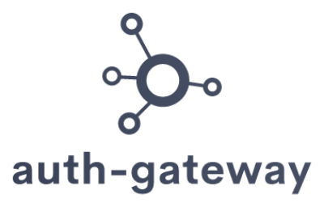
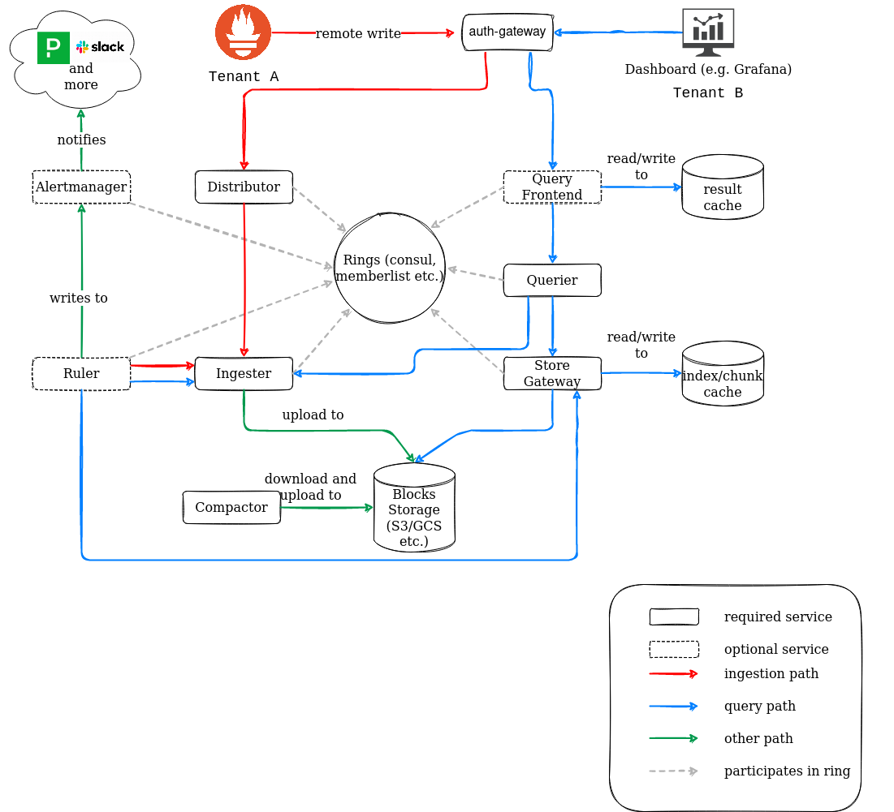

<p align="center"></p>

[](https://github.com/cortexproject/auth-gateway/actions)
[](https://godoc.org/github.com/cortexproject/auth-gateway)
<a href="https://goreportcard.com/report/github.com/cortexproject/auth-gateway"></a>
<a href="https://cloud-native.slack.com/messages/cortex/"></a>
<!-- <a href="https://bestpractices.coreinfrastructure.org/projects/6681"></a> -->

# auth-gateway: Microservice that helps you administrating and operating your [Cortex](https://github.com/cortexproject/cortex) cluster in multi-tenant environments

`auth-gateway` is an entry point for all requests towards Cortex. This gateway is responsible for handling multi-tenancy features without complicated proxy configuration.

## What problem does `auth-gateway` solve?

When operating Cortex with numerous tenants, it's crucial to distinguish your tenants each time they make requests to a specific component. This differentiation is essential to ensure that each component processes its own requests independently.

To achieve this, Cortex microservices necessitate the inclusion of a header named `X-Scope-OrgID` in each request. According to the Cortex Kubernetes (k8s) manifests, it's recommended to implement an NGINX server (eg. [nginx-config.yaml](https://github.com/cortexproject/cortex-helm-chart/blob/master/templates/nginx/nginx-config.yaml)) within each tenant's infrastructure, serving as a reverse proxy.

The primary function of this server is to route the traffic and establish the `X-Scope-OrgID` header for the corresponding tenant. However, setting up an NGINX server for each tenant is complex and has limitations. For instance, you cannot define custom timeouts separately for each tenant.

So, we created `auth-gateway`, a microservice that helps you administrating and operating your Cortex cluster in multi-tenant environments with just a simple configuration.

[//]: <> (diagram url -> https://viewer.diagrams.net/?tags=%7B%7D&highlight=0000ff&edit=_blank&layers=1&nav=1&title=#R7V1pd6o6F%2F41Xeu%2BH8piHj461I6eDh572vvlLMSIVCSWwaG%2F%2Fk0QrCSpIkWLve096yoBI%2B797J09hhOpMZ6f%2B%2BZk2IZ94J6IfH9%2BIjVPRFGQZBW94JFFMqLhQzxi%2B04%2FGXsf6DhvIBnkk9HI6YMgc2EIoRs6k%2BygBT0PWGFmzPR9OMteNoBu9lsnpg2ogY5luvToH6cfDpNRgeffT1wAxx4mX60ryYmxmV6cDARDsw9na0PS2YnU8CEMl%2B%2FG8wZwMfVSuiw%2F1%2Frg7OrGfOCFeT5gv9mP9ftLf6h2W%2FB5Lrhv0%2BtTSVpOMzXdKPnFyd2Gi5QEaBpEbXRQRz9hggctF0Zo1vps6ISgMzEtPDhDCEBjw3DsoiMBXz4CoYWJwONx0xpGPjjHFzVlNPDi2Hb8FYgS9QH0wpY5dlyMkwYcOxa6h47pBeil3UkuSNAhqOiY%2FvUJQabAD8F8bSihxjmAYxD6C3RJgsXTFGOzNcbqydhwjaeCnAyaCZjs1Vzv9EZvEpKzyT%2F1vLO%2BaV8rjt7RBOO8PZpEp5qcg%2Fxev4aBHNPdDAJEmgyVfRh5fdBPjkg6gbkTPiXn8PvnhB34fXO%2BfrBIDzz0y57WD%2BLPcKqgpAPvH4yP0k%2F2zWC4upEg9OEINKAL%2Ffh3SPX4v9WZVJrEdJo74DuIqsBPZtsKiRW8hE14CGDkW2ADD1Q9USumb4Nw04XL60A%2FozFoeK3BSWGgKR3zgWuGzjSrZ1gIS77hDjrop4l8im0tmSdBsygRIF3%2B8ORT63qBmEg2shNJkpKdaEkYaiIESnOxdtkEXxBQIrEiTHEpSSX7XUiaDgKR04tCBC5SXrLysEVFkeJSEuhyKKHkrCgTbOQZSklkwGhvOoleEe4jEN9yy0fUQeqoXJJntMbB6a%2BKVaM%2FvSRcejYIsGL8XlCXpa8mtcKEunP0lCZBLQnKF1NapSj94Hg2JsA%2FyHIPIjRBAxvNYNwDvou0O15oQ4v7H20OrazRLVwwg8nSIRg4c8w5ii204XRQJskCoXkUhjjIhzVHKS7R5C%2FfGuWUAvaosC9b9FBmZ6Lmj8zqVPQsaBWhoNWp8AbHSzqvGAj5uibLWYWl85yhCobMa5omiIqa%2FZIvt0iNQwkKX0RQhJOM47Y3t%2B1QoqIcpahI%2FAfmzs4OmkKs5nLlHDTakKrAwlF5XKfxzCPDtVISrjcvAaLOPFsdzB%2FMWCphDTj2FUA6TkkhVgDKvcq9AqgbJcWouKTQ1lInhD5AQ%2BdmCGbmghKc43a3vz6wIdIh08oqp6P35FJ8H5l2UglXThaLruN61e1TOU%2BWcydxoHDI84YhNz%2FEYUZ0VgGNd9cszyrNzJKt5HAleyuZ%2BlAOqxbiSIFXEcEQSXVedNlWiIlUnphoZ8HIZ2coZCUAaU6QQZzs9ejN8g6KyiCz0oCxJEUTF5p9jBBIiyPCwo3ZAy4R1HUd28MiisCIZaCOV2nHMt1acmLs9Pt4jroPAufN7MXzYdAnRESTK%2FUTpVnEbqAlYbO2IQ2IVZVKclsn64UgLMPilOeQu6VlmJV6jZ8FuZqdlZwBDgYBCAlYlKOM6WAB4lXk4puzTGsIKCysyk4WroN0sC9ttwl7S21901sNmNbIjnX4bRSiaUCqyBMAKNVLEOhEvmxVm7JuVvIMPajvy6yU6TQOZsgcTWYNI2%2F0w8HNHJRZFUeH5WDpUQuGJaS1Wq18llAB46Wo9VS1UIVSKZuHROqqjHFXm8fgt0z0gc1T2uqiHzvAq5ZVSd3bH6SWjNTSk4jHooq%2FtNwzd7SmYl6pIZWFe6MY7nf1Ssn40javVNH265WylWAJQvgZscsKcHnlMduz%2Fl8qhHmNJLlaVpKmEJkXraAM6oQwi2Tsdc9rj0o7cmWvPa0Wj%2F52WnuysBeL4V7cBvzK9RXIlcI4tTwUTQsIvLJlpn2DnPZ1ay7y3cemZ9pl1%2Fh%2BbRV75ZoIVNoNe4jcb030r8%2F6pqtRtYyZgh6FlnEptiWJK6fUK%2BY1l%2BY9CDxRti6TNlBJ7oNAuOepO%2FHRjWnC565XlB2vFw7gnqhH4J5oxew07cdO%2B5xE66VJ9LaI2p7tNJFetuoutEaY0bhQDHfoi6qLyFfv%2BRnsq68R7p6PoXK6zAPV0AWCOpnHkEjPo3c2fv2ngxzP1nmjg9nI7C76jyaqZJVQbirDlmElqgSy%2F6M8Y0b8vOrbvaY8r3myW6yl8iVsqat0ZCVsEqEDv3EPfFrVW62IzXdK3ObtxqiWGUDZ4zpZZJbfDtC2zLRnO0Dbf1BylypNJsQ3b51SOZM11esVAStlsxbtHqVtVnKm8rDKrGZkdLzNfGQmYk7jakbVHGMz0esFkxWnv0d140pKS6luFNVsdaP4OZztv3pRz7EOp06EM443F1txMeb4HQyc0IGYmz0YhnCMLnDxifrKbUgVVh8MzCj2e0gchBDDitrhIP7CWjrKpyPo%2FTAM8YZpNUwPsbUsvOVmzsgZg75jctC30TA%2BnuBjXM8Hx2OIwdEKh9G4h16x6yQhxdO68zEVhyAK%2FgZwEM4QYv660IZcMMWziLyK%2FK%2FTTVdxE8%2BunhMkqkoGi6cKxyeJyjX1qDHUo2pw6UZqn%2FGDFKae6CSH0A%2BHiH6e6Z69jxI0e7%2FmBmKIxIMvIAwXCZ3NCGknRnhofSXcEDBap7gV%2BVPQcsLQwcxcftP6lm7MlafYemcwOgkkNi9za45POacGrQWayMfrQdPvo%2BF%2FAGdz6PXcNwemZ9JhhlhdA%2F9sCpZaO2ZEuj9gxmPkNwXzPIiDC%2FWB47pr7JIlWZYVln5wCQVErTMfaqgPFBC5XsFlwKOx2oyRP3nfNXA8t%2FEmkdx02ue8YP63v6JYeaqAL0cVrIrM1gRflbg0JpExjQxOVPcEs1XIpWo1YmIBt2%2FHXSmqVgZZLbdPJQMWKhGwyGtJkxNRzU5lVYORuwZsqwYj00y7Xp9N5%2BwnPYOcb0o%2BEVQnpvUNNiYUs9aQYnz1HmJCao2VnA3LHRIgsmFFC%2B%2BKFvl9WcUsnzc0VrGSWSLaIBSNjJFR5gPHGugcsA9w22QrjjicMNsnkZCHO1qOyVD%2BGARLg72LCE%2BaZSVvAB0fJz%2BYL0HfaUQKjNVtpzKwSqYcytvDIUc49LiWFJ0o6dBYVjaDxGTdYHkkpisEffAaOT7AXlwA%2FKlj0c2Mn5ctFwxYUZ2cklUNXhrbeblSlIdhZo5amSOuNqSEJ6d%2B2hu9U8W3Rm84wXED0%2F0Rnh2Fh8HLwwpPrudA%2FOd28KuMHZuFiyHzHE%2Fs8pXbllWpubITfXmlg0Sn1hBrkKw7E3OZYHM8TFMcdv7RLjm0i8EoTD%2Bwdtl%2FU%2FYOxSvfWzkU7tchNcOh23Uk2n5z4gcf4FQE5gAi5o%2B855B3nbHLyGHlXS5h%2B8Hyyta%2FubyrZck7OdG%2B9z8QKZC8Jg%2Ba%2BZH13LLOeGjEYWVdp9lIse5zYSqaoQcnu0ZkrzSGipWYZC9jJyd2Bdp%2Bmv0KJkO%2BuY41DK5gfpXSsvRU%2By5VpBdjGA5xK%2B6Pns2vZ40D6lk2G2kfqg9nXrKDpomfysZv2lDz%2B2eESmC7xBNJb5mR9FYUmu3GvtieavWf7F%2FZvCYTfjJj04R9JfzYrN5PecN%2FfC%2BiipgUGrlbhFzcpNg%2B1Z5NCvE4i%2BD7ZmieSLXlodjCRehiw3ms3z7M%2BOtzG9bQ369Od3jWtdG7Jv5fTW7U2uilMfjTDgI88Nyqtx%2FPuud%2B82VZTI%2F%2B6bXXl7o7k%2Bzaa8MJpd7jYi53HEGFtcni4k4Nf2MW3KGzb%2FdRwCvS4nkI5xeLq7fJn4WkTdDJBRTHol%2BrwVntX%2F8NDTSU9vBpOpbmJ2J9cAmD7sujFvqXahvfuBG9WZqBa%2FFD4fWOnwj303PQ1F7VEb5Dpeue3T8%2BXDpAfBTv1eZlvd4SH18nsOEIf8bR0%2Bq2b5zXoWBaV7XB7b3%2B27tsNK%2BsOuy%2BjM7bdqc26I%2F6U6V%2BBayzqKXeCtq9%2B7vR7fZ49%2B3C%2BdfxavX2tfr8MlJHz91fD093bvNh%2FNb1%2F5WiEFxN%2FlzevJ2%2Fzq666D4eJ2FN%2Fq2Nfp89GLfAG4TGM%2Fr25%2FEI9i%2Bb6Hf2Jh3rtnHdvAT9kRkh9vvzi5en2cXrYGS1PPnKBFqzOetJ6jy6bjemzzLfmFqDsH5r81aE6PP2oM359rSN36tnTR6%2BXbU851f02DhT3pz%2Bnemq3tUFeNZC874ZLc4uwPRShhfO9cVT%2B2kRiB1rBOH5g8M%2F2IPauebVvNHNxY0yusfUrF89dJUzf3Rl27jMPf5XTst1RojF9xaCNYXEevxjGfV1bKnO8RSvCkp1trVlCFwHBqcONzbRvfZcwFnoPsRWfDUmUivOJbk4kdTiZa0bPN40%2FGjSHY%2BDyAknnuDN4ml8eBp%2FhsNWEod79%2F8KoqzPNV7kpoIqSpImG6qStLKU4nJwaaHdRkxoPGcYB4SFRPuPS29jHD%2FD58f0LGB6Zhdwlcnng9qejKSrB0Nn4ICgDBv0IFGlIh27603p2a50zihktX6IjkJ7MLB5JVXKstWJynuDL27ZalunKs%2ByFejVrUD7XNFdDVjp7I1NeO8J7l2a8Aq17DDhtRXUefd0%2FQCsn22IEbONxIqYC4I7t7EQkeG0pvwjRJOP5iGu%2F3RbSvoUysP2jL6jStv%2F%2Fh8Va1DNC%2FPP9qcWg6ci7QRPco%2FusuHJimgtd%2FLqO9N0V650CK%2F2GSjvur0XAurw1E4fKbmcFN3hct7sd6HhzB0QMrRTwrIA6BibJ1Cw%2B9B6JDdK1ziJX%2F8TKFNSYGUqZJlTS2hcrVRpV5GgZZE4Yyld7cutJL7KbJMIs00rWFCqEGF00kUpz2Bj9UGNYZwDSXIhjJXwwLusfD4rnntflSzo9I0qA2%2B1okvZ6IJQCoyILlHi86Xsw8J4cuDOS4ZOLRn8wLSyn2kgxDtxXvwXmNGry2%2FgmfG31dZ3o6SWlexqU8noSAlrkKhk%2BZ4uSWu6y9hT%2FCJdYKoCh%2FoPHERdVDk9G9BmFEyUhAh06EPMi3d9gvcVacM%2B1vRn%2Fwc%3D)



## Features

* Enabling multi-tenancy feature of Cortex with just a simple configuration
* Supporting HTTP basic authentication
* Defining custom timeouts for each of your components
* Load balancing

## Configuration

### Generic Placeholders

* `<int>`: any integer matching the regular expression [1-9]+[0-9]*
* `<duration>`: a duration matching the regular expression [0-9]+(ns|us|µs|ms|s|m|h|d|w|y) where y = 365 days.
* `<string>`: a regular string
* `<url>`: a URL

```yaml

# The main server that auth-gateway will listen on. Any request that comes to this server will be forwarded to the corresponding component. Requires authentication.
server: <server_config>

# A supporting server that exposes metrics, ready and pprof endpoints. Does not require authentication.
admin: <server_config>

# List of all tenants that auth-gateway will serve.
tenants: <tenant_config>

distributor: <component_config>

frontend: <component_config>

alertmanager: <component_config>

ruler: <component_config>

```

### server_config

The `server_config` configures the servers.

```yaml

# hostname or IP address that auth-gateway will listen on, not a url
address: <string>
port: <int>
http_server_read_timeout: <duration> | default = 30s
http_server_write_timeout: <duration> | default = 30s
http_server_idle_timeout: <duration> | default = 120s

```

### tenant_config

The `tenant_config` configures the tenants.

```yaml

- authentication: basic
  username: <string>
  password: <string>
  id: <string>
- ... # more tenants

```

### component_config
The `component_config` configures the components. Although the default timeout values are defined below, these default values differ depending on the component. To learn each component's timeout values, please refer to the [default timeout values](#default_timeout_values) section.

```yaml

url: <url>
  dns_refresh_interval: <duration> | default = 1s
  paths:
    - <string>
    - <string>
  http_client_timeout: <duration> | default = 15s
  http_client_dialer_timeout: <duration> | default = 5s
  http_client_tls_handshake_timeout: <duration> | default = 5s
  http_client_response_header_timeout: <duration> | default = 5s

```

### <a name="default_timeout_values"></a> Default Timeout Values

Each component in the `component_config` has different default timeout values. They are as follows:

| Component    | `http_client_timeout` | `http_client_dialer_timeout` | `http_client_tls_handshake_timeout` | `http_client_response_header_timeout` |
| ------------ | --------------------- | ---------------------------- | ----------------------------------- | ------------------------------------- |
| Distributor  | 15s                   | 5s                           | 5s                                  | 5s                                    |
| Frontend     | 1m                    | 5s                           | 5s                                  | 5s                                    |
| Alertmanager | 15s                   | 5s                           | 5s                                  | 5s                                    |
| Ruler        | 15s                   | 5s                           | 5s                                  | 5s                                    |

You can override these default values by specifying your desired timeout values in the `component_config` for each component.

## Contributing

We welcome contributions. Please follow the [contributing guidelines](CONTRIBUTING.md).

## <a name="help"></a> Getting Help

If you have any questions about `auth-gateway`:

- Ask a question on the [Cortex Slack channel](https://cloud-native.slack.com/messages/cortex/). To invite yourself to the CNCF Slack, visit http://slack.cncf.io/.
- <a href="https://github.com/cortexproject/auth-gateway/issues/new">File an issue.</a>
- Send an email to <a href="mailto:cortex-users@lists.cncf.io">cortex-users@lists.cncf.io</a>

Your feedback is always welcome.
